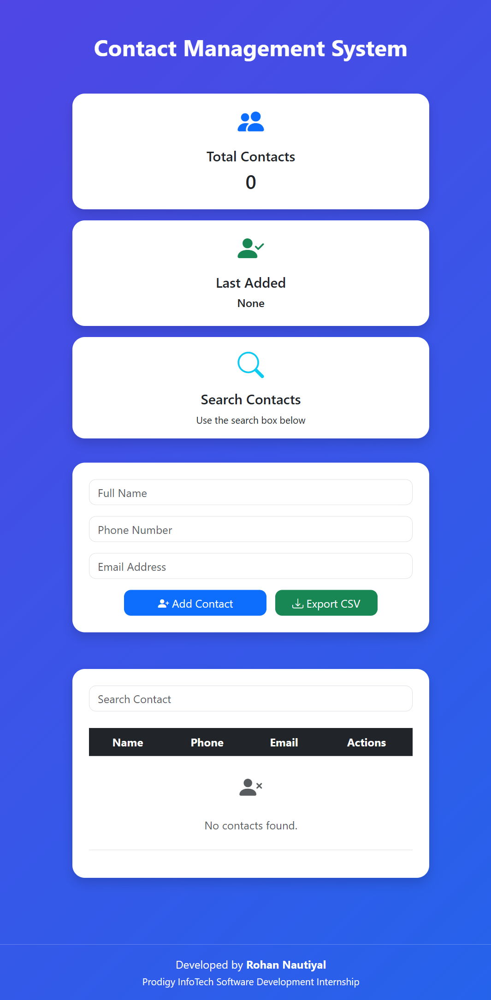
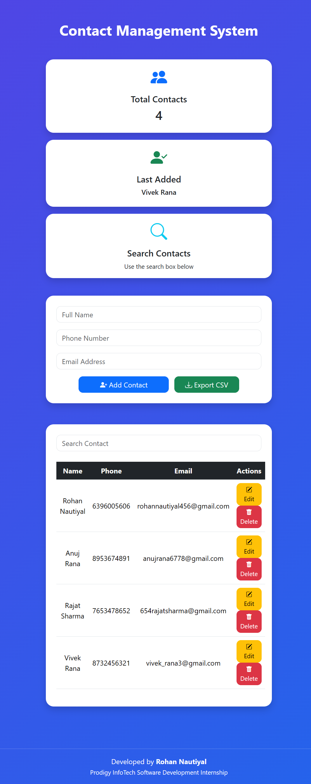
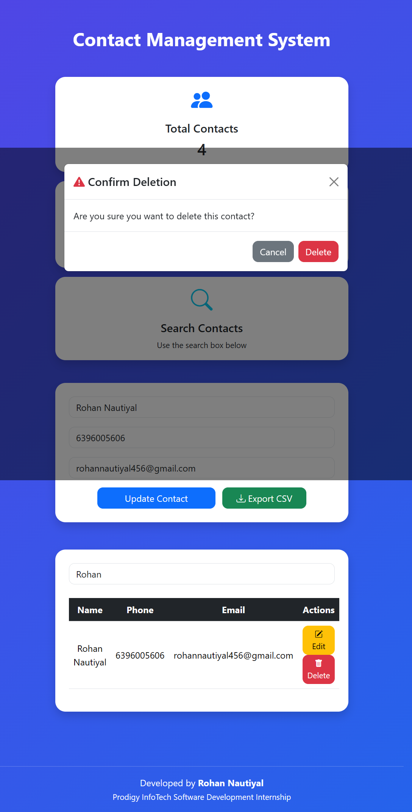
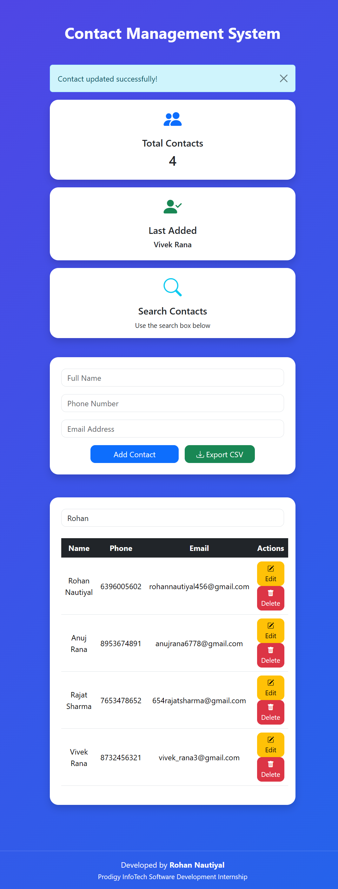
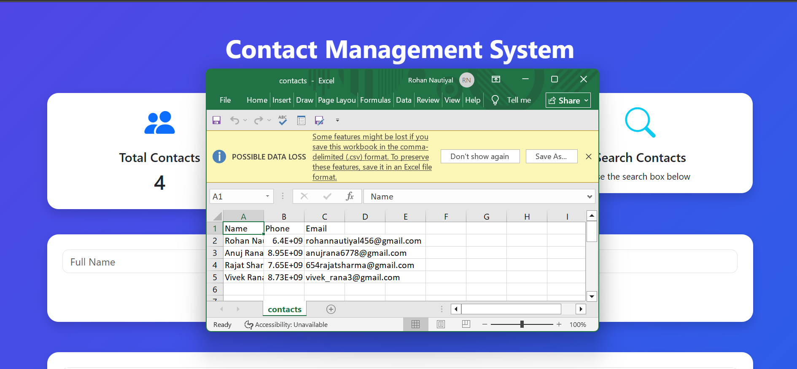

# Contact Management System

A simple, responsive, and user-friendly **Contact Management System** built using **HTML, CSS, JavaScript, and Bootstrap** as part of my **Software Development Internship** at **Prodigy InfoTech**.

The goal of this project was to build a practical CRUD (Create, Read, Update, Delete) application with a clean interface and persistent data storage. Instead of just creating a basic contact book, I focused on making the application easy to use and adding a few extra features that improve the overall user experience.

---

## Features

- Add new contacts
- Edit existing contacts
- Delete contacts with a confirmation modal
- Live search by name, phone number, or email
- Automatic data storage using Local Storage
- Dashboard displaying contact statistics
- Export contacts to CSV
- Input validation for name, phone number, and email
- Bootstrap alert notifications for user actions
- Responsive design for different screen sizes

---

## Built With

- HTML5
- CSS3
- JavaScript (ES6)
- Bootstrap 5
- Bootstrap Icons
- Local Storage API

---

## Preview

### Home Screen



### Adding Contacts



### Live Search and delete



### Edit/Update Contact Details



### CSV Export




---

## Getting Started

Clone the repository:

```bash
git clone https://github.com/RohanNautiyal/PRODIGY_SD_03.git
```

Open the project folder and launch `index.html` using **Live Server** (recommended) or simply open it in your browser.

---

## What I Learned

Working on this project helped me strengthen my understanding of:

- CRUD operations using JavaScript
- DOM manipulation
- Local Storage
- Form validation
- Bootstrap components (Cards, Tables, Alerts, Modals)
- Building responsive user interfaces
- Organizing JavaScript into reusable functions
- Git & GitHub workflow with meaningful commits

---

## Project Structure

```text
PRODIGY_SD_03/
│
├── index.html
├── style.css
├── script.js
├── README.md
└── screenshots/
```

---

## Future Improvements

Some ideas I'd like to explore in the future:

- Dark Mode
- Import contacts from CSV
- Cloud database integration
- User authentication
- Contact profile pictures

---

## Author

**Rohan Nautiyal**

Software Development Intern at Prodigy InfoTech

GitHub: https://github.com/RohanNautiyal/PRODIGY_SD_03

---

If you found this project helpful or have any suggestions, feel free to connect or share your feedback.